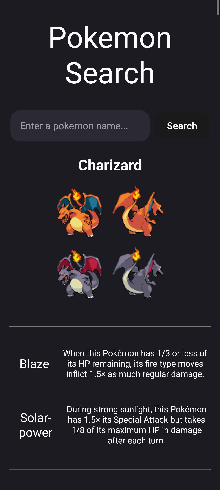
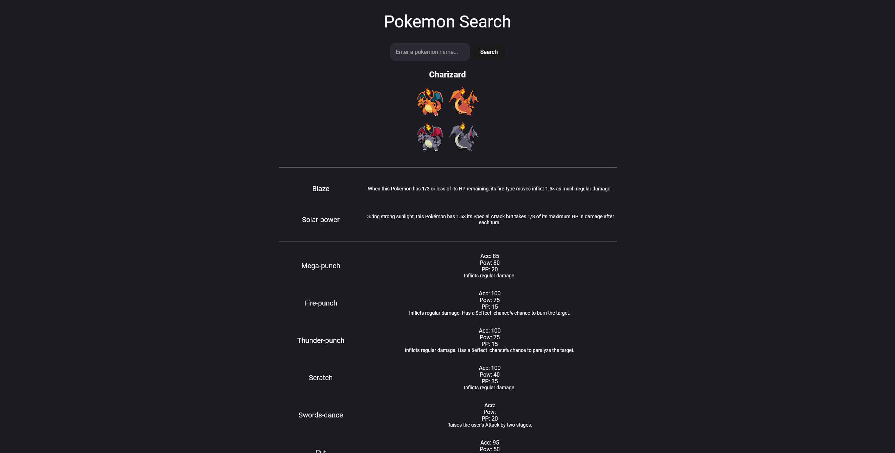

# Pokemon API Practice

This project was mainly created to practice the basics of using an API. I didn't focus too much on the design of the site. I only made it clear and responsive enough to get the information out.

## Table of contents

- [Overview](#overview)
  - [Screenshot](#screenshot)
  - [Links](#links)
  - [Built with](#built-with)

## Overview

### Screenshot

### Links

- Solution URL: [GitHub](https://github.com/Sengsith/pokemon-api-practice)
- Live Site URL: [Netlify]()

### Built with

- Semantic HTML5 markup
- CSS custom properties
- Flexbox
- CSS Grid
- Mobile-first workflow
- [React](https://reactjs.org/) - JS library
